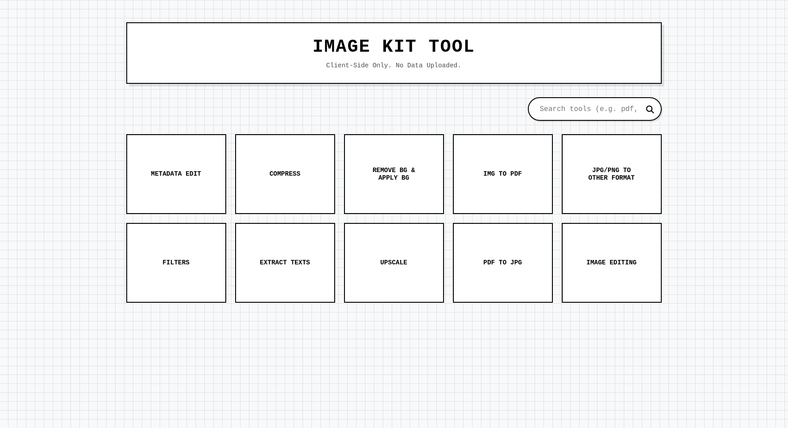
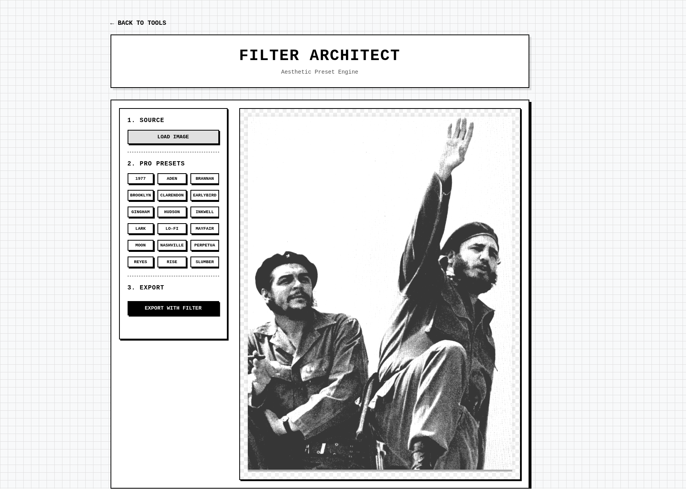

# ImageKit | AI Image Helper Kit


ImageKit is a high-performance, privacy-focused image processing suite built with **Node.js & Express**. Unlike traditional tools, ImageKit performs heavy-duty AI tasks—like background removal and neural upscaling—entirely within the user's browser using **WebGPU** and **TensorFlow.js**, ensuring data never leaves the local machine.

## 🌐 [Live Demo](https://evident-aila-thegoddo-95e659e3.koyeb.app/)





---

## 🚀 Key Features

### 1. Subject Architect (AI Background Remover)

- **AI Extraction:** Uses the `RMBG-1.4` model via ImageKit WebComponents for instant, high-precision subject isolation.
- **Manual Refinement:** Integrated HTML5 Canvas tools for manual brush-based and box-based erasing using `destination-out` compositing.
- **Custom Backdrops:** Dynamic layering of solid colors or custom-uploaded images behind the extracted subject.

### 2. Resolution Architect (Neural Upscaler)

- **Super-Resolution:** Implements `UpscalerJS` to hallucinate missing pixels and upscale images by 2x, 3x, or 4x.
- **Hardware Safeguards:** Intelligent fallback to CPU if WebGPU/WebGL is unavailable, with patch-based processing to prevent system hangs.

### 3. PDF Deconstructor

- **Frame Extraction:** Converts multi-page PDFs into high-quality JPEGs using `PDF.js`.
- **Selection Logic:** Supports print-style page range selection (e.g., "1, 3, 5-8") for targeted extraction.

### 4. Filter Architect

- **Cinematic Presets:** Custom-engineered CSS filters for aesthetics like **Polaroid**, **Retro**, and **Wong Kar Wai**.
- **Baking Engine:** A "Canvas Baker" that captures real-time CSS filter styles and applies them directly to image pixels for high-quality export.

---

## 🛠️ Tech Stack

- **Frontend:** EJS (Embedded JavaScript Templates), CSS3 (Wireframe Aesthetic), Vanilla JS.
- **Backend:** Node.js, Express.
- **AI/ML:** TensorFlow.js, RMBG-1.4, UpscalerJS.
- **Imaging:** HTML5 Canvas API, PDF.js.

---

## 📦 Installation & Setup

1. **Clone the repository:**
   ```bash
   git clone https://github.com/your-username/imagekit.git
   cd imagekit
   ```
2. **Install dependencies:**

   ```bash
   npm install
   ```

3. **Start the local server:**

   ```bash
   npm start
   ```

   The app will be available at <http://localhost:3000>.

## 🛡️ Privacy & Performance

This project is built on the principle of Edge Computing. By offloading image processing to the client's GPU:

- **Zero Server Costs:** The backend only serves static assets, making it infinitely scalable on free tiers like Koyeb.

- **Total Privacy:** Images are processed in RAM and never uploaded to any server, making it safe for sensitive documents.

## 🎨 Aesthetic

The UI follows a Retro-Wireframe design language, focusing on high-contrast borders and a clean, utilitarian "developer tool" feel.

## 💡 Pro-Tips for your Portfolio

- **Add Screenshots:** Once you deploy to **Koyeb**, take high-quality screenshots of the "Subject Architect" and "Filter Architect" in action and add them to the `README`.
- **Live Demo Link:** Place your Koyeb URL at the very top so recruiters can test the AI speed immediately.
